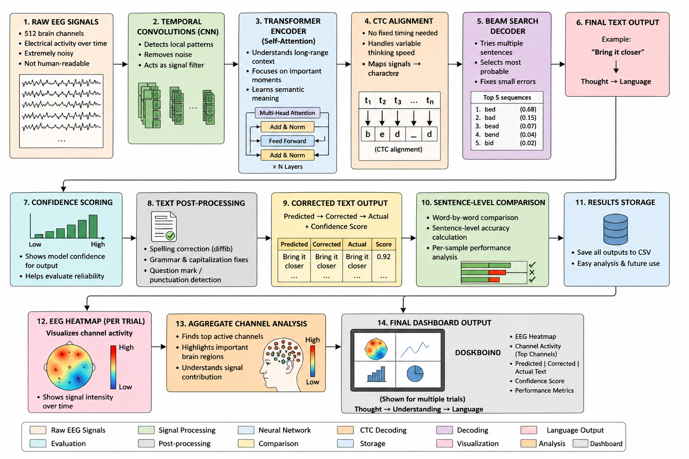
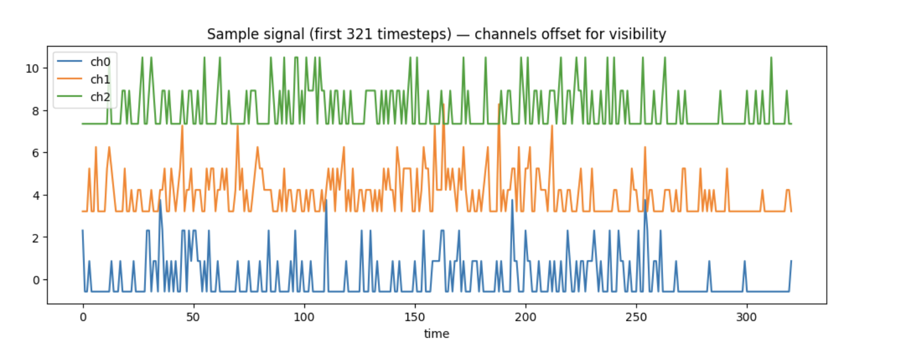
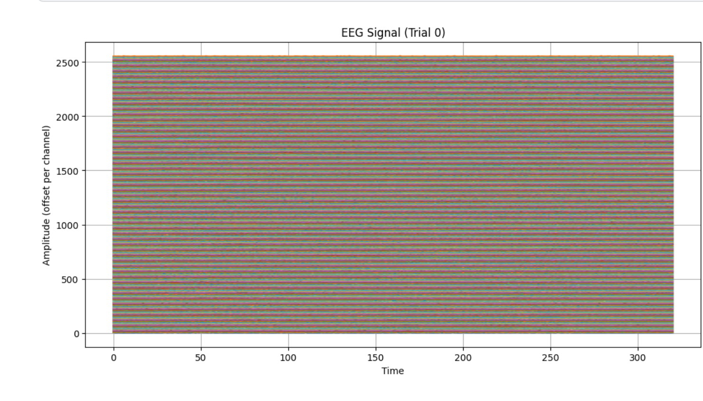

# Brain-to-Text using EEG Signals

An end-to-end deep learning framework for translating electroencephalography (EEG) signals into meaningful textual representations using Transformer-based neural decoding.

---

## Overview

This repository contains the implementation and experimental analysis for a non-invasive Brain–Computer Interface (BCI) system designed to decode neural activity into coherent text sequences. The work explores the feasibility of EEG-based language generation using deep learning architectures that combine temporal modeling, contextual attention mechanisms, and sequence decoding strategies.

The proposed framework integrates EEG preprocessing, Transformer Encoder networks, Connectionist Temporal Classification (CTC) decoding, and post-processing techniques to generate interpretable textual outputs from brain signals.

This work was developed as part of a research-oriented investigation into neural decoding and assistive communication systems.

---

## Motivation

Communication impairments caused by neurological disorders can significantly restrict an individual's ability to express thoughts verbally despite preserved cognitive function. Brain-to-text systems aim to address this challenge by enabling direct translation of neural activity into language.

EEG signals present a particularly challenging modality due to their:

- low signal-to-noise ratio,
- temporal variability,
- inter-subject differences,
- and high dimensionality.

This project investigates whether Transformer-based architectures can effectively model such signals and recover meaningful linguistic representations.

---

## Methodology

The proposed pipeline consists of the following stages:

### 1. EEG Preprocessing

- Band-pass filtering for physiological EEG frequency isolation
- Noise and artifact reduction
- Signal normalization

### 2. Data Augmentation

- Temporal masking
- Channel dropout
- Gaussian noise injection

### 3. Neural Sequence Modeling

- Convolutional feature extraction
- Transformer Encoder architecture
- Multi-head self-attention mechanisms
- Context-aware temporal representation learning

### 4. Sequence Decoding

- Connectionist Temporal Classification (CTC)
- Beam search decoding
- Confidence scoring

### 5. Post-processing

- Grammar refinement
- Sentence-level comparison
- EEG heatmap visualization

---

## Architecture

<p align="center">
  
</p>

---

## Experimental Results

The model was evaluated on approximately 1,450 EEG test samples.

| Metric                | Value             |
| --------------------- | ----------------- |
| Word Error Rate (WER) | ~0.29             |
| Effective Accuracy    | ~72.25%           |
| Decoding Strategy     | CTC + Beam Search |

The results demonstrate that Transformer-based neural decoding architectures can effectively capture contextual EEG representations and generate coherent textual sequences.

---

## EEG Visualization

### Raw EEG Signal

<p align="center">
  
</p>

### EEG Heatmap Representation

<p align="center">
  
</p>

The heatmap representation highlights temporal and spatial activation patterns across EEG channels, providing interpretability into neural activity distributions.

---

## Repository Structure

```bash
brain-to-text-eeg/
│
├── notebooks/
│   ├── training_pipeline.ipynb
│   └── inference_demo.ipynb
│
├── assets/
│   ├── model_architecture.png
│   ├── raw_eeg_signal.png
│   └── project_overview.png
│
├── results/
│   ├── eeg_heatmap_trial0.png
│   ├── prediction_output_1.png
│   ├── prediction_output_2.png
│   └── sentence_comparison_1.png
│
├── README.md
├── requirements.txt
└── LICENSE
```

---

## Technologies Used

- Python
- PyTorch
- NumPy
- MNE
- Matplotlib
- Scikit-learn
- Transformer Architectures

---

## Research Context

This project was developed in the context of EEG-based neural decoding research and focuses on advancing non-invasive Brain–Computer Interface systems for assistive communication.

The work explores:

- neural signal representation learning,
- sequence-to-sequence decoding,
- EEG interpretability,
- and language reconstruction from brain activity.

---

## Future Directions

Potential extensions of this work include:

- real-time EEG-to-text inference,
- integration with large language models,
- cross-subject generalization,
- multimodal biosignal fusion,
- and explainable AI techniques for neural interpretation.

---

## Citation

If you use this work in academic research or derivative projects, please cite appropriately.

```bibtex
@project{brain_to_text_eeg,
  title={Deep Neural Modelling for Brain Signal-to-Text Conversion Using Electroencephalography (EEG) Data},
  authors={Anubhav Bhattacharjee , Nabamita Deb},
  year={2026}
}
```

---

## License

This repository is released under the MIT License.
